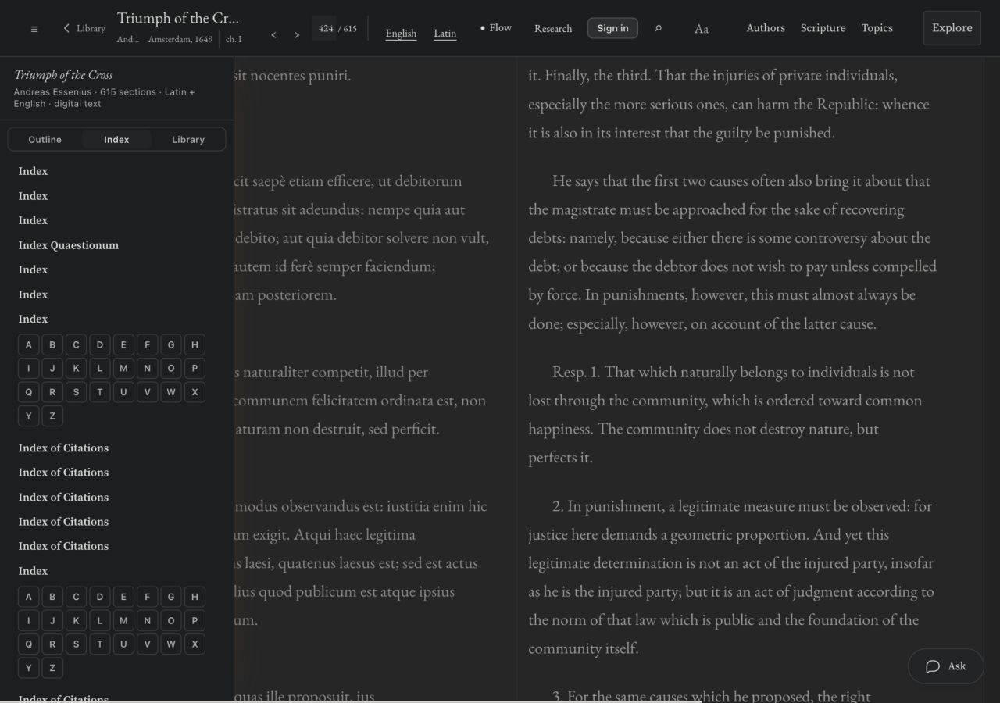
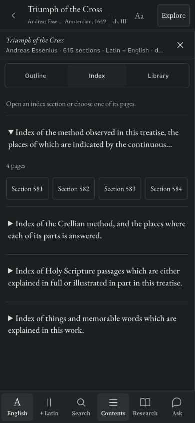

# Essenius reader QA and repairs

The work-reader audit found a broken Index tab, misleading Scripture links, inaccessible controls, and old passage context being reused by a new work question. It also exposed a stalled native deletion confirmation during the Desk round trip. [The QA report](QA-REPORT.md) lists the controls actually exercised, the findings repaired, and the checks that must not be reported as passed.

The repair is live on Vercel as **dpl_HoSsiGTB9Gme6F8JWzWmaYqtGXjy**. Six changed asset files match the production alias. 78 focused tests and the build gates pass. This is not a MereO deployment or a complete backend/frontend port certification.

## Source and integration

Nine full source/test references are inventoried in source-manifest.json. reader-qa.patch isolates the five production source changes against the immediately preceding revision. The source files retain their extensions followed by .txt. Port the changes to the corresponding native MereO reader and Desk sources; do not overwrite the complete native template or its Cloudflare route and storage adapters.

The new indexSections helper uses the existing outline, index-page inventory and edition page order; it preserves opaque page identifiers and never fabricates letter destinations. Keep its reader-navigation.js implementation and reader template integration in the same release. The Scripture change concerns display linking only and leaves every source character unchanged. Bare num. requires an explicit verse before it is treated as Numbers; spelled-out book names and explicit verse citations continue to work.

Whole-work Ask entry points now pass fresh:true and the selected work scope. Opening a saved conversation through Chats still resumes that conversation. Keep this distinction when applying the native Ask adapter. No model, provider, inference budget, worker, or corpus code changed.

Desk deletion is an in-page two-step action: Delete exposes Confirm delete and Cancel. Cancellation preserves the document, storage-write failure preserves its editor, and successful deletion cancels pending autosave for that document. The document title and delete controls are separately accessible.

Use MereO's existing R2/Workers data paths and authenticated request adapters. Do not add Vercel or an ungated staging-worker dependency. Run the normal native theme build and commit its generated assets after integrating the changes. Keep the path guard and protected Worker files intact.

## Existing artifact update

Add this dated QA checkpoint to the existing reader section B and the implementation log. Link the full report and source package, show the broken Index and repaired mobile view, and preserve the existing artifact address, section IDs/order, prior figures, and measured corpus counts. Use the HANDOFF_PACK skeleton/rebuild workflow. State that these repairs are live on Vercel and supplied for MereO integration; do not label the entire site audit or the export/account checks complete. Online artifact publication was not performed in this pass.

| Broken Index: repeated alphabet controls | Repaired Index: source sections and real page links |
|---|---|
|  |  |
