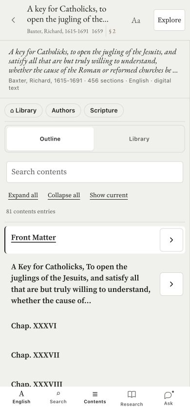
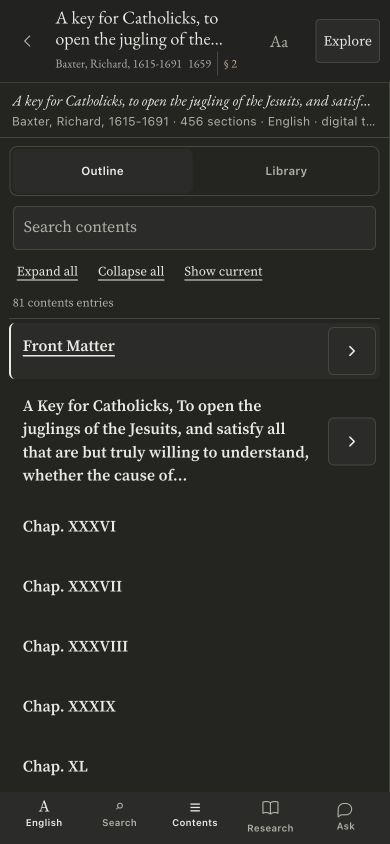
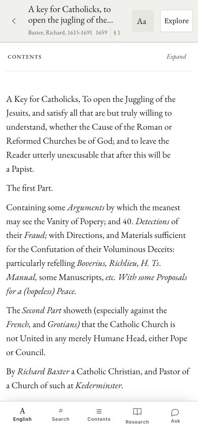

# Mobile history focus and Contents repair

The owner supplied iPhone screenshots showing unwanted input zoom and an oversized Contents header. This folder provides full source, a narrow patch and actual Chrome phone-width comparison images. **Vercel deployed; MereO integration pending.** Final desktop verification was interrupted by browser timeouts. Do not mark the iPhone zoom issue fully resolved from desktop emulation.

## Current release status

Vercel deployment `dpl_Baf6BmjVFHatA4WKYnti4N4KyLBb` is READY. The protected deployment script passed its build/drift/protected-file gates and public-alias marker check. Six relevant assets, including reader-core.js, match the deployed bytes; see alias-proof.json. 42 focused contents/source-navigation/Ask tests pass. The first deployment attempt was refused, but the same protected pipeline succeeded on retry after account/project access was verified.

The final release adds an explicit 44px Close contents control and clears search focus when the drawer closes while preserving outline scroll and expansion state. toc-usability.patch isolates that last addition. The larger bottom toolbar, compact identity/controls and mobile Ask history focus fix are included. Final browser/actual-iPhone interaction checks remain pending because browser control timed out; do not claim those passed. Existing screenshots below show an EARLIER local layout preview, before the final close button and bottom-toolbar update.

MereO is not deployed by this handoff. Apply the current full sources or the ordered narrow patches to the native port, preserving adapters and guards. Mark Vercel deployed and MereO pending in the existing artifact, retain its address and A–F identities, and capture fresh final-release comparisons when browser access resumes.

## Behavior

Opening Saved questions on touch/narrow layouts focuses the sidebar instead of the search input, so merely navigating to history does not request the keyboard. The sidebar receives `tabindex=-1`; desktop keyboard users still focus search. The history field explicitly uses 16px at every breakpoint. Existing mobile 16px rules were already live; the original iPhone zoom cannot honestly be attributed solely to their absence.

The mobile reader Contents header uses a single clipped title line and compact metadata. Duplicate Library/Authors/Scripture chips hide only if the existing Explore menu is available. The distinct All confessions link is retained. Tabs and toolbar actions remain 44px high; independent expansion buttons remain 48px. No source heading, TEI, row pairing, apparatus content or corpus data changes.

## Apply to the native port

The three complete Vercel originals are `ask-workspace.js.txt`, `ask-workspace.css.txt`, and `reader-contents.css.txt`; hashes are in manifest.json. Apply the narrow changes to the matching port workspace and reader CSS, preserving MereO routes, membership and the current source version. Use mobile-repair.patch as a guide, not a blind replacement of the Ghost theme. Native legacy Ask history from PR12 already avoids automatic input focus; this new workspace change addresses the full port renderer.

Run the normal theme build and commit the built files. Preserve the path guard; protected file edits remain maintainer work. Before merging, verify phone and desktop, light/dark, English-only and bilingual readers, branch expansion and opening an actual section, history open/tap/switch/reload, and keyboard dismissal without horizontal clipping. Test the actual iPhone behavior after release; pinch-to-zoom must remain available. No viewport zoom restrictions are added.

## Evidence

The mobile history check observed ASIDE as activeElement on opening, then 16px for an explicitly tapped search field and 390px panel width. Toolbar/expansion heights measured 44/48px. Pointer and Enter toggled a Contents branch after reader initialization. 25 Ask tests and build secret/script gates passed. The English Baxter work is eebo-26874; bilingual test is pld-212.

| Current Vercel, mobile dark | Local repair, mobile dark |
|---|---|
|  |  |

## Artifact update

Add this repair as a dated fold in existing section B, Reader, and cross-reference C, Search and Ask. Keep the existing artifact URL, A–F identities, all existing figures and measured counts. Label images as current Vercel before/local preview after. Distinguish the verified Vercel deployment from pending live interaction acceptance and pending MereO integration. Update the existing change log and surface matrix; rebuild using the supplied HANDOFF_PACK/rebuild.py and verify the same artifact address. The backend audit is in private worker PR4; do not copy detailed security findings or ungated origins into a public artifact.

## Bottom reading toolbar, added September 13

The owner also requested the bottom toolbar on /read. `reader_shell.html.txt` contains the full updated Vercel template; `bottom-toolbar.patch` isolates this additional change. Labels are 12px (11px below 360px), icons 22px, and buttons have a 52px minimum height. The footer, Contents inset, highlight bar and text clearance share one toolbar-height variable including the bottom safe area. The same English/source-language/scan/search/contents/research/Ask actions remain; no row-pairing or source content change. Language/scan buttons expose pressed state and Contents exposes expanded state.

Final build secret and script-parse gates pass, and Vercel is deployed as recorded above. Browser toolbar interaction verification remains pending because the connection times out. The screenshots above show the earlier Contents repair, NOT this additional toolbar change. Do not reuse them as proof of the new toolbar. Verify 320/390px, all seven controls when present, English-only and bilingual/facsimile works, text end clearance, open/close Contents, light/dark, keyboard interaction, and unchanged desktop behavior before release.

Include the toolbar addition in the existing artifact section B mobile-reader fold, link its source/patch, and retain pending status until live verification.
