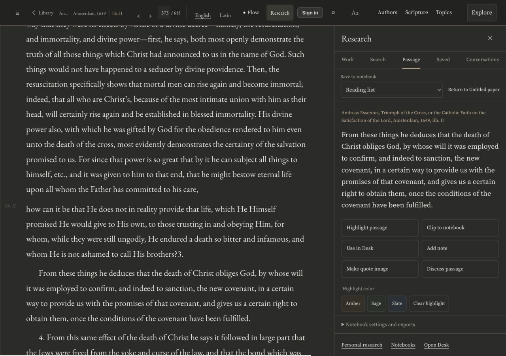
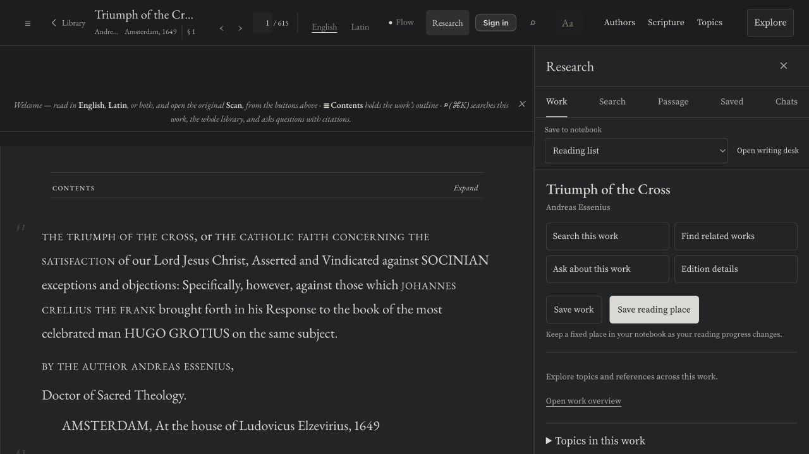

# Calmer dark mode and discoverable related works

The reader previously mixed olive and brown dark surfaces, and related-work search was absent from its main Research navigation. This repair makes the shared dark palette neutral, opens Research on Work, and adds direct task controls. **Research → Work → Find related works** opens the Search tab's Related works mode. This work continues to search the current canonical text. Topics, Scripture, sources, saved research and conversations retain their own destinations; detailed analysis is folded below the main work tools.

[Full findings and validation](REVIEW.md). [Production byte verification](alias-proof.json). Vercel deployment: `dpl_4MUgahdaSZhXXFXUJjnyYiukQ1GR`. MereO integration is pending.

## Apply the source

The seven files in source-manifest.json are complete source references, stored with a .txt suffix. reader-calm.patch isolates the five production-source changes against the previous reader revision. Review and port the corresponding template, Research behavior and shared tokens together; do not overwrite MereO's entire native reader with the Vercel template. The two test sources exercise the related-search lifecycle and the canonical text-search workflow.

Keep the existing whole-work source module, notebook adapter, canonical catalogue resolver, source navigation and Ask scoping. Related searches must be requested by the user, cached, abortable and bounded. Moving to another passage must not initiate an automatic query. Preserve page identifiers as strings and keep every edition's identity distinct. Legacy patristic vector anchors are not canonical page IDs and must never be fabricated into page links. Where the resolver supplies only a held work, open that work and show its printed citation.

## Cloudflare adaptation

Route the request adapter through MereO's existing authenticated Worker client, preserving paid-member and budget handling. The Vercel reference uses GET /api/related?s=<slug>&p=<page> and GET /api/vsearch?q=<idea>&k=16&sparse=1. Confirm the equivalent protected Worker handlers and their response shapes before enabling the control. `mountRelated` accepts a request adapter and a catalogue resolver. The related response supplies works as {slug,page} and optional fathers as {src,doc,cit,anchor}; the idea response supplies results as {slug,page}. Missing, empty, malformed and failed responses must remain distinguishable.

Use R2-backed catalogue data and MereO's native reader/search route builders. Preserve target=_blank and rel=noopener on related source links. Never point the public theme at Vercel Blob, Upstash, the owner's Hugging Face service, or an ungated staging worker. Backend security and runtime-parity findings belong in private worker PR 4. This folder supplies frontend reference code; it does not certify Worker parity or deploy either MereO runtime.

Apply the palette to the native Ask and Desk surfaces as well as the reader. Keep explicit light, dark, sepia and system preference behavior. Run the normal theme build and commit generated theme assets after native integration; do not change the path guard.

## Update the existing Claude artifact

Add a dated reader/Research repair note under the existing section B and update its implementation status using the measured evidence here. Include the before/after dark comparison and mobile Related works screenshot. Keep the existing artifact address, section IDs/order, figures and measured corpus counts. Mark this as live on Vercel and source supplied for MereO, with MereO integration pending. Edit hub-skeleton.html, add figures, run rebuild.py, and publish to the existing artifact only through an authorized accessible session. Do not claim the full frontend/backend audit is complete or that the online artifact has already been updated.

| Previous dark reader | Revised dark reader |
|---|---|
|  |  |

[Mobile related-work search](live-related-mobile.jpg) · [Overall audit status](AUDIT-STATUS.md)
