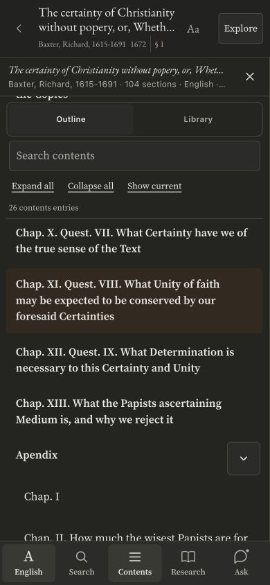

# Reader Contents scrolling repair

The reported defect was text painting through the gap above the sticky Outline/Library tabs. The tab strip and search/actions block were separate sticky elements inside a padded scroll container. At the end of the list, 30vh of padding also created a long empty scroll tail.

The repair groups the tabs and filter/actions into one opaque sticky header and leaves all original source rows in the original navigation scroll container. The header meets the fixed work-identity area without a paint-through gap. The container measures the actual header height for current-section scroll clearance. On screens at most 880px wide and 520px high, the header scrolls away normally so controls do not consume nearly the entire outline viewport. Rebuilding or switching tabs releases the old observer/header cleanly, while retaining the saved query, scroll position and expansion state. Opening Contents clears reading-header auto-hide state, and reading scroll events cannot re-hide the header while the mobile panel is open.

No source text, TOC hierarchy, page/column IDs, row pairing or work titles were changed.

## Release status

Deployed to https://thefaithreceived.vercel.app through the protected pipeline: `dpl_5AFmTF8qyoeMwniyJwrUXMGK9co1`. The public reader page, runtime and both Contents module assets match the local deployment bytes. The live reader was reloaded for a post-deployment scroll check: nav scroll moved 0→844, underlying text remained 0, and headerTop/workBottom both stayed 139px. MereO integration is still pending; this PR supplies source and instructions, not a Ghost deployment.

## Validation

43 focused contents/source-navigation/Ask tests pass. The new regression test proves the header groups only controls, keeps source rows in the original container, preserves scroll through rebinding and releases the wrapper when leaving the outline. The build's secrets and script-parse gates pass.

Real browser checks used the in-app browser with 390×844 phone, 1280×900 desktop and 640×390 landscape viewports. This is browser emulation, not an actual iPhone certification. Baxter eebo-33684 and bilingual Alain de Lille pld-212 were checked. On the English phone test, the header stayed at 139px and underlying text scroll stayed at 0 while the outline moved from 0 to729.5. On the expanded Latin outline, headerTop stayed 118 while nav scroll moved 0→844 and text scroll stayed 11919. In short landscape, the control header was static and scrolled with the list while underlying text remained stationary. Library/Outline switching removed and restored exactly one header; Show current revealed the selected source entry. Phone light/dark and desktop dark views were inspected.

See the JSON metrics and screenshots in this folder. Values are observed fixture positions, not invariants to hardcode.

## Full source and port instructions

source-manifest.json inventories four complete source files. toc-scroll.patch isolates the production code change. Preserve MereO's native route and storage adapters when applying the matching reader code; do not overwrite the full native template blindly. Keep reader-contents.js, reader-contents.css and reader runtime in the same release, then use the normal theme build and commit its output. Do not alter the path guard or corpus licensing.

Update section B of the existing Claude artifact with this dated repair and the before/after comparison; keep the same artifact address, A–F IDs, prior figures and measured counts. Record Vercel deployment separately from MereO integration. The full site frontend audit remains incomplete and must not be represented as finished by this narrow repair. Backend source/contract audit and its live-verification limits are in private mo-workers PR 4.

| Before: text visible above tabs | After: one opaque control header |
|---|---|
|  |  |

[Overall audit status and remaining work](AUDIT-STATUS.md). The source/contract report and selected frontend checks are not a completed end-to-end audit.
